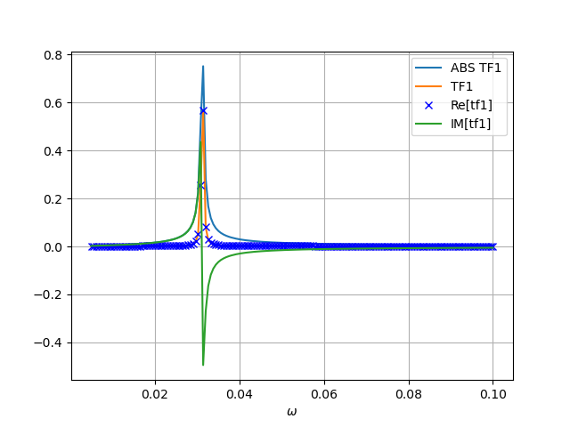
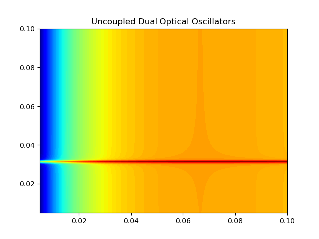

# Optical Oscillators Transmission Line Theory

This repository contains various scripts to simulate optical oscillators using transmission line theory.

## References: 
1. [R. Ulrich (Mar 1967). "Far infrared properties of metallic mesh and its complementary structure". Infrared Physics. 7 (1): 37–50.](https://www.sciencedirect.com/science/article/abs/pii/0020089167900280)
2. [Sternberg, Oren. Resonances of periodic metal-dielectric structures at the infrared wavelength region. New Jersey Institute of Technology, 2002](https://digitalcommons.njit.edu/dissertations/548/)

### Dependencies
* see [requirements.txt](https://github.com/0r3ntal/optical_oscillators/blob/main/requirements.txt) for python libraries

### Output

### Contact information
email: oren.sternberg@icloud.com

